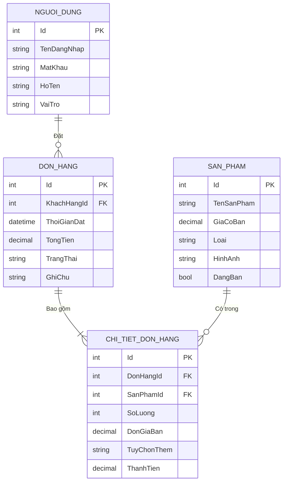

# 📊 PHÁC THẢO MÔ HÌNH DỮ LIỆU ERD (DÀNH CHO MS ACCESS)

Tài liệu này cung cấp mô hình thực thể liên kết (ERD) và danh sách cấu trúc các bảng chi tiết để bạn có thể dễ dàng tạo lại cơ sở dữ liệu trên Microsoft Access.

---

## 1. SƠ ĐỒ THỰC THỂ LIÊN KẾT (ERD)

---

## 2. HƯỚNG DẪN TẠO BẢNG TRÊN MS ACCESS

Dưới đây là thiết kế chi tiết từng bảng để bạn dễ dàng tạo trong chế độ **Design View** của Access:

### Bảng 1: `NguoiDung` (Lưu tài khoản Khách hàng, Nhân viên, Admin)
| Tên cột (Field Name) | Kiểu dữ liệu (Data Type) | Thuộc tính / Ràng buộc (Properties) | Ý nghĩa |
| :--- | :--- | :--- | :--- |
| **Id** | AutoNumber | **Primary Key** | Mã người dùng tự tăng |
| **TenDangNhap** | Short Text | Field Size: 50, Required: Yes | Tên tài khoản |
| **MatKhau** | Short Text | Field Size: 50, Required: Yes | Mật khẩu |
| **HoTen** | Short Text | Field Size: 100, Required: Yes | Họ và tên |
| **VaiTro** | Short Text | Default Value: "KhachHang" | Vai trò (Admin/NhanVien/KhachHang) |

### Bảng 2: `SanPham` (Lưu Menu Trà sữa và Topping)
| Tên cột (Field Name) | Kiểu dữ liệu (Data Type) | Thuộc tính / Ràng buộc (Properties) | Ý nghĩa |
| :--- | :--- | :--- | :--- |
| **Id** | AutoNumber | **Primary Key** | Mã sản phẩm tự tăng |
| **TenSanPham** | Short Text | Field Size: 150, Required: Yes | Tên món |
| **GiaCoBan** | Currency / Number | Decimal, Required: Yes | Giá bán gốc |
| **Loai** | Short Text | Field Size: 20 (TraSua / Topping) | Phân loại |
| **HinhAnh** | Short Text / Long Text | | Base64 hoặc Link ảnh |
| **DangBan** | Yes/No (Boolean) | Default Value: Yes (True) | Trạng thái (Đang bán/Tạm ngưng) |

### Bảng 3: `DonHang` (Lưu thông tin hóa đơn tổng quát)
| Tên cột (Field Name) | Kiểu dữ liệu (Data Type) | Thuộc tính / Ràng buộc (Properties) | Ý nghĩa |
| :--- | :--- | :--- | :--- |
| **Id** | AutoNumber | **Primary Key** | Mã hóa đơn tự tăng |
| **KhachHangId** | Number | **Foreign Key** (Liên kết `NguoiDung.Id`) | Mã khách đặt hàng |
| **ThoiGianDat** | Date/Time | Default Value: Now() | Thời điểm đặt món |
| **TongTien** | Currency / Number | Decimal | Tổng thanh toán |
| **TrangThai** | Short Text | Default Value: "Chờ xác nhận" | Tình trạng đơn |
| **GhiChu** | Short Text | | Yêu cầu thêm (VD: ít đá) |

### Bảng 4: `ChiTietDonHang` (Lưu các món nằm trong hóa đơn)
| Tên cột (Field Name) | Kiểu dữ liệu (Data Type) | Thuộc tính / Ràng buộc (Properties) | Ý nghĩa |
| :--- | :--- | :--- | :--- |
| **Id** | AutoNumber | **Primary Key** | Mã chi tiết tự tăng |
| **DonHangId** | Number | **Foreign Key** (Liên kết `DonHang.Id`) | Thuộc đơn hàng nào |
| **SanPhamId** | Number | **Foreign Key** (Liên kết `SanPham.Id`) | Khách chọn món gì |
| **SoLuong** | Number | Integer, Required: Yes | Số lượng mua |
| **DonGiaBan** | Currency / Number | Decimal | Giá bán tại thời điểm mua |
| **TuyChonThem**| Short Text | | Tùy chọn (Size L, Đường...) |
| **ThanhTien** | Currency / Number | Decimal | = SoLuong * DonGiaBan |

---

## 3. CÁCH NỐI RELATIONSHIPS TRONG ACCESS
Sau khi tạo xong 4 bảng trên, bạn vào thẻ **Database Tools** > **Relationships**:
1. Kéo `Id` của bảng `NguoiDung` thả vào `KhachHangId` của bảng `DonHang` (Tích chọn *Enforce Referential Integrity*).
2. Kéo `Id` của bảng `DonHang` thả vào `DonHangId` của bảng `ChiTietDonHang` (Tích chọn *Enforce Referential Integrity* & *Cascade Delete*).
3. Kéo `Id` của bảng `SanPham` thả vào `SanPhamId` của bảng `ChiTietDonHang` (Tích chọn *Enforce Referential Integrity*).
